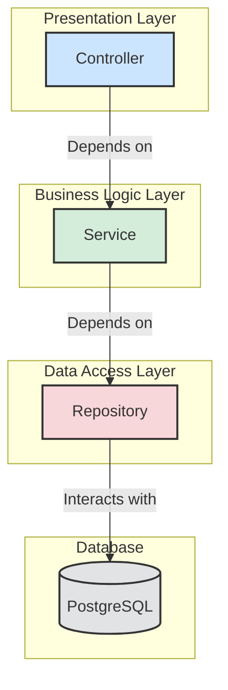

# Backend Project Document

This document outlines the backend architecture, technology stack, and coding conventions for the project.

---

## 1. Architecture

We'll use a classic **3-Layer Architecture** to ensure a clear separation of concerns, making the application easier to develop, test, and maintain. The layers are Presentation, Business Logic, and Data Access.

### Component Breakdown

- **Presentation Layer (`Controller`)**

  - **Job**: This layer is the entry point for all client requests. Its primary responsibility is to handle HTTP requests (e.g., GET, POST, PUT, DELETE), validate incoming data (DTOs), and delegate the request to the appropriate service. It then formats the service's response and sends it back to the client.
  - **Dependencies**: `Business Logic Layer (Service)`.

- **Business Logic Layer (`Service`)**

  - **Job**: This is the core of the application. It contains the business logic, rules, and orchestrates operations. It processes data received from the controller, executes business workflows, and manages transactions. It is completely decoupled from the presentation layer's protocol (e.g., it doesn't know about HTTP).
  - **Dependencies**: `Data Access Layer (Repository)`.

- **Data Access Layer (`Repository`)**

  - **Job**: This layer is responsible for all communication with the database. It handles the Create, Read, Update, and Delete (CRUD) operations for data entities. It abstracts the underlying data storage details from the business logic layer.
  - **Dependencies**: `Database (PostgreSQL)`.

---

## 2\. Tech Stack 🛠️

| Category             | Technology / Library       | Version / Notes                                 |
| :------------------- | :------------------------- | :---------------------------------------------- |
| **Language**         | Java                       | `17`                                            |
| **Core Framework**   | Spring Boot                | `3.x`                                           |
| **Database**         | PostgreSQL                 | Latest stable version                           |
| **Data Access**      | Spring Data JPA, Hibernate | Manages entities and repository implementations |
| **API**              | Spring Web (MVC)           | For building RESTful APIs                       |
| **Build Tool**       | Maven                      | For dependency management and build automation  |
| **Testing**          | JUnit 5, Mockito           | For unit and integration testing                |
| **Containerization** | Docker                     | For creating consistent environments            |
| **Logging**          | SLF4J with Logback         | Default logging provided by Spring Boot         |
| **Configuration**    | YAML (`application.yml`)   | For environment-specific properties             |

---

## 3\. General Coding Rules

Adhering to these rules is crucial for code quality, readability, and long-term maintainability.

### Naming Conventions

- **Packages**: `com.company.project.feature` (e.g., `com.projectx.auth`).
- **Classes & Interfaces**: `UpperCamelCase` (e.g., `UserService`, `UserController`).
- **Methods & Variables**: `lowerCamelCase` (e.g., `getUserById`, `activeUser`).
- **Constants**: `UPPER_SNAKE_CASE` (e.g., `MAX_LOGIN_ATTEMPTS`).
- **Database Tables/Columns**: `snake_case` (e.g., `user_accounts`, `first_name`).

### Code Structure

- **DTOs (Data Transfer Objects)**: Use DTOs to transfer data between the `Controller` and `Service` layers. This prevents exposing internal domain models directly to the client.
- **Exception Handling**: Implement a global exception handler (`@ControllerAdvice`) to manage exceptions consistently. Create custom exceptions that extend `RuntimeException` for specific business errors (e.g., `UserNotFoundException`).
- **Immutability**: Prefer immutable objects where possible, especially for DTOs and configuration properties.
- **Single Responsibility Principle**: Each class and method should have one clear purpose. Keep them small and focused.

### Best Practices

- **Logging**: Use SLF4J for logging. Log meaningful messages at appropriate levels (`INFO` for business events, `DEBUG` for development details, `ERROR` for failures). Avoid logging sensitive information.
- **Configuration**: Externalize all configurations (database credentials, API keys) in `application.yml`. Use Spring Profiles (`dev`, `staging`, `prod`) to manage environment-specific settings.
- **Testing**:
  - Write unit tests for services and utilities. Aim for a high level of code coverage.
  - Write integration tests for the controller and repository layers to ensure they work together correctly.
- **Security**:
  - Use **Spring Security** for authentication and authorization.
  - Always validate and sanitize all user input to prevent vulnerabilities like SQL Injection and XSS.
- **Version Control (Git)**:
  - Use a consistent branching strategy (e.g., GitFlow).
  - Write clear and descriptive commit messages.
  - All code must be reviewed via Pull Requests before merging into the main branch.
