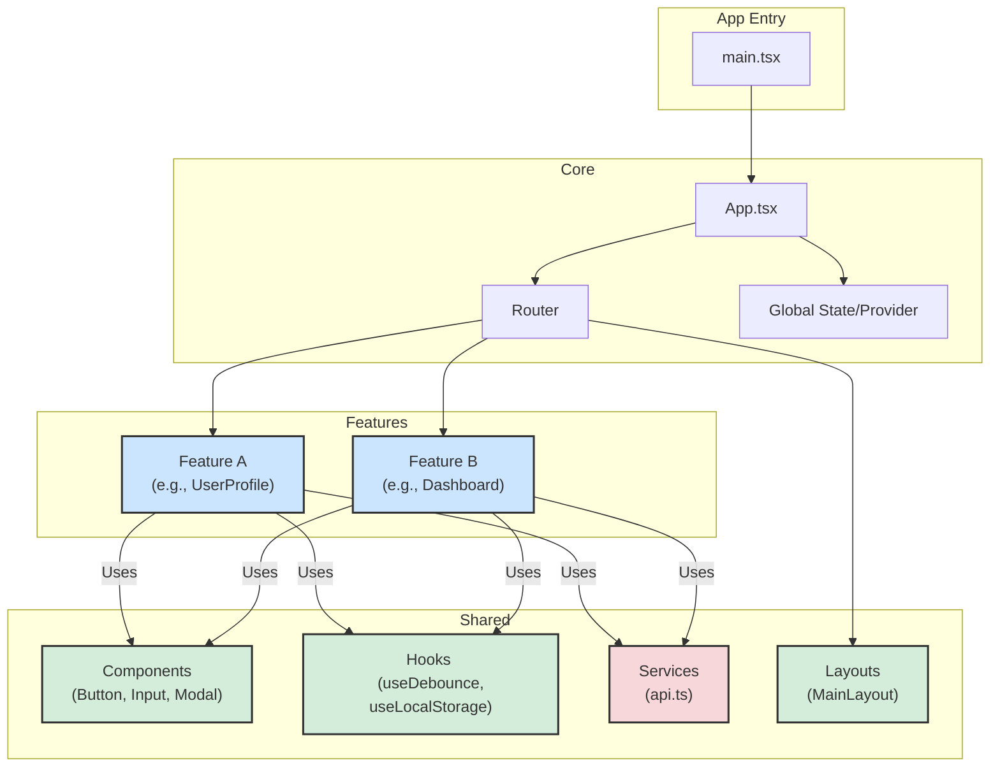

Of course. Here is a frontend project document based on a React tech stack.

---

## 1\. Architecture

We will adopt a **Feature-Based Component Architecture**. This approach organizes the codebase by feature (e.g., `products`, `auth`, `cart`), making it scalable and easy to navigate. Each feature directory is self-contained, holding its own components, state logic, and styles. This is supplemented by a `shared` directory for truly reusable elements across the entire application.

### Component Breakdown

- **Features**: These are the main sections of your application (e.g., `auth`, `userProfile`, `products`). Each feature folder contains all related files: components, custom hooks, and feature-specific state logic.
- **Shared/Common Components**: This directory holds **reusable, "dumb" UI components** like `Button`, `Input`, `Card`, and `Modal`. They are presentation-focused and receive data via props.
- **Services/API**: Contains the logic for all **external communication**, primarily with the backend REST API. We'll use a centralized client (like Axios) to handle requests, responses, and error handling.
- **Hooks**: A collection of **reusable custom hooks** that can be used across different features (e.g., `useDebounce`, `useClickOutside`).
- **State Management**: This involves managing data that needs to be shared across the application. We'll use a combination of local state, global state, and server state management.
- **Layouts**: Components that define the main structure of a page, such as a header, footer, and sidebar (`MainLayout`, `AuthLayout`).

---

## 2\. Tech Stack 🛠️

| Category               | Technology / Library           | Notes                                                    |
| :--------------------- | :----------------------------- | :------------------------------------------------------- |
| **UI Framework**       | React                          | `18.x`, using functional components and hooks            |
| **Language**           | TypeScript                     | For static typing and improved developer experience      |
| **Build Tool**         | Vite                           | For fast development server and optimized builds         |
| **Routing**            | React Router                   | For client-side navigation and declarative routing       |
| **State Management**   | Redux Toolkit                  | For predictable and centralized global application state |
| **Data Fetching**      | RTK Query                      | For managing server state, caching, and API calls        |
| **Styling**            | Tailwind CSS                   | A utility-first CSS framework for rapid UI development   |
| **Testing**            | Vitest & React Testing Library | For fast, component-focused unit and integration tests   |
| **Linting/Formatting** | ESLint & Prettier              | To enforce code style and identify potential issues      |

---

## 3\. General Coding Rules

Adherence to these rules ensures our codebase is consistent, readable, and maintainable.

### Naming & Structure

- **Folders**: Use `kebab-case` for feature folders (e.g., `user-profile`).
- **Components**: Use `PascalCase` for component files (e.g., `UserProfile.tsx`).
- **Hooks**: Prefix custom hooks with `use` and name with `camelCase` (e.g., `useUserData.ts`).
- **File Structure**: Each component should be in its own file. For components with associated styles or tests, create a folder for them (e.g., `/Button/index.tsx`, `/Button/Button.test.tsx`).

### Component Design

- **Functional Components**: Exclusively use functional components with hooks.
- **Props**: Use **TypeScript interfaces** to define component props for type safety.
- **Composition**: Keep components small and focused on a single responsibility. Create larger, complex UIs by composing smaller components together.
- **Separation of Concerns**: Separate logic (hooks) from presentation (JSX). A component should ideally focus on rendering UI based on its props and state.

### State Management

- **Local State (`useState`)**: Use for state that is only relevant to a single component (e.g., form input values, modal visibility).
- **Global State (Redux Toolkit)**: Use for state that is shared across many components and features (e.g., authentication status, user information, theme).
- **Server State (RTK Query)**: Use for all data fetched from the backend. This handles caching, re-fetching, and loading/error states automatically. **Do not store server data in the global Redux store.**

### Best Practices

- **API Calls**: Centralize all API fetching logic within the **services/API layer** and expose it through RTK Query endpoints. Components should not make direct `fetch` or `axios` calls.
- **Conditional Rendering**: Keep JSX clean. For complex conditional logic, use helper functions or move the logic outside the `return` statement.
- **Keys**: Always provide a stable and unique `key` prop when rendering lists of elements.
- **Testing**: Write tests for custom hooks and complex utility functions. Write integration tests for components to verify they render correctly and respond to user interaction.
- **Accessibility (a11y)**: Write semantic HTML and use ARIA attributes where necessary to ensure the application is usable by everyone.
